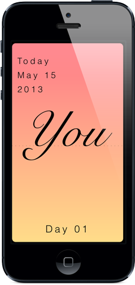

# Word Diary

A day in a word. https://frodrig.github.io/worddiary/

Word Diary is a minimalist iOS diary where you write a single word to describe your day. One word. That is it. A word that will take you back in time when you read it again.

The app lets you choose from four calligraphic fonts and different soft colour palettes to make each entry yours. A visual calendar shows your words month by month and year by year, each one with its own colour and typography.

It was available on the App Store and reached version 3.0. Built in 2013, no longer maintained.

## Features

Single word per day entry with calligraphic font selection, soft colour palette customisation, monthly and yearly calendar view, persistent storage with Core Data and English and Spanish localisation.

## Code

The app is written in Objective-C using UIKit and Core Data. The architecture follows MVC with a singleton data layer and custom views for the calendar grid and word display. The visual system, colour gradients based on HSL and typography variations, was the core of the user experience.

59 source files. No tests. Some commented out code and hardcoded values typical of a solo side project. Crash reporting via Crashlytics was integrated.

## How to run

Open the Xcode project inside the Code folder. You will need Xcode and the Fabric and Crashlytics frameworks. The project targets iOS 6.1 and was last built against an older Xcode version so there may be warnings or compatibility issues with modern tooling.

## Web

The original product website is in the Web/Output folder. It was built with iWeb in 2013.

## Built by

Fernando Rodríguez Martínez. frodrig76@gmail.com
